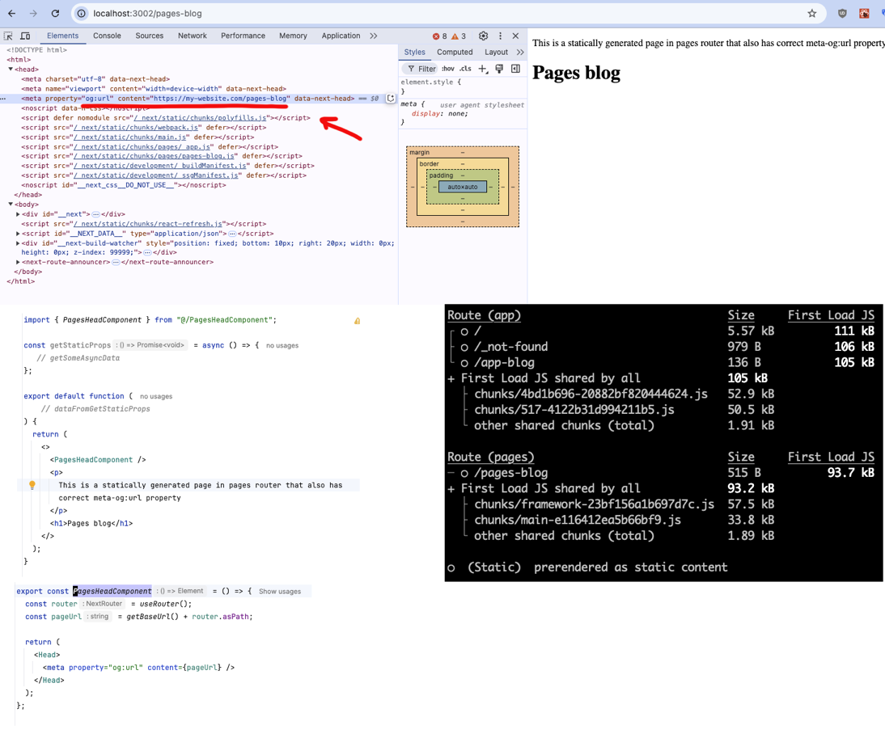
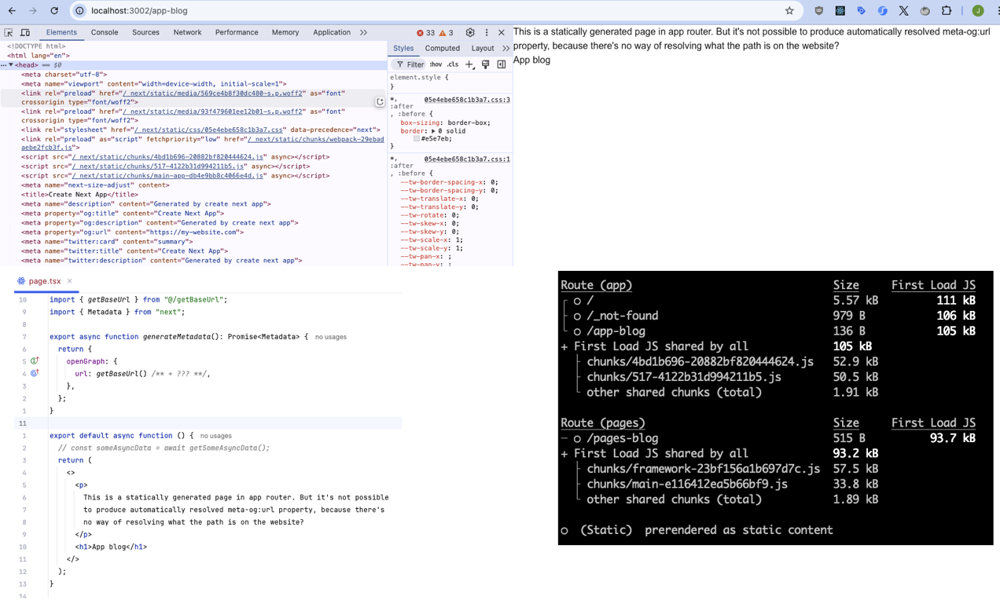

This is a [Next.js](https://nextjs.org) project bootstrapped with [`create-next-app`](https://nextjs.org/docs/app/api-reference/cli/create-next-app).

## The shortest version
I want `src/PagesHeadComponent.tsx` component that works with App router.

## Problem description

- I want to be able to add `<meta property="og:url" content={pageUrl} />` to all pages without having to specify `pageUrl` manually. 
- In pages router that was easy to achieve. See example in a page component `src/pages/pages-blog/index.tsx`
  - By simply adding `<PagesHeadComponent />`, correct meta og:url is added.
- In app router, there's seemingly no way to get the current pages path/url. See `src/app/app-blog/page.tsx`

## Pages router

## App router

      

